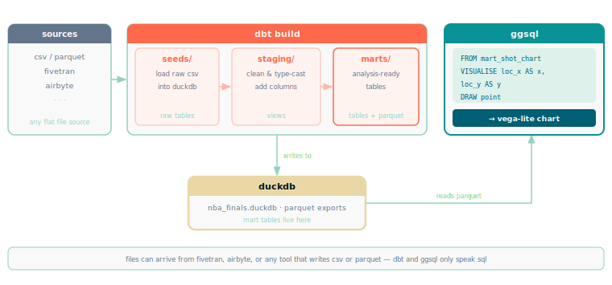

# ggsql + dbt · posit hackathon 2026

SQL engineers build an entire data pipeline without leaving their query editor. At the last step, they hand finished tables to analysts who reload them into Tableau or Looker — just to see what's already there. The SQL is written. The data is clean. The BI tool adds one thing: a picture.

[ggsql](https://github.com/posit-dev/ggsql) extends SQL with Grammar of Graphics visualization syntax. dbt transforms raw data into analysis-ready tables. Put them together and the pipeline outputs charts directly — **no BI tool between the data and the picture.**

```sql
FROM revenue_by_region          -- dbt mart table
VISUALISE region AS x,
         total_revenue AS y,
         segment AS color
DRAW bar
  SETTING position => 'dodge'
LABEL title => 'revenue by region'
```

Anyone who writes SQL already speaks this language.

---



---

## three output modes

This repo demonstrates the same dbt + ggsql pipeline with three levels of output, controlled by a single `OUTPUT` variable.

| command | output | what you get |
|---|---|---|
| `OUTPUT=cli make` | `output/charts/*.html` | 11 individual chart files |
| `OUTPUT=static make` | `output/static/index.html` | navigable static bundle |
| `make` | `nba_report.html` | full narrative report with TOC |

The data is a fictional 2026 NBA Finals (Knicks vs Spurs), built from seeded CSVs. The pipeline runs entirely in DuckDB — no external database required.

## quick start

```bash
cd nba_dbt
uv sync --python 3.13
uv run dbt build --profiles-dir . --project-dir .

cd ..
OUTPUT=cli make          # option a: individual charts
OUTPUT=static make       # option b: static bundle
make                     # option c: full quarto report
```

**requires:** [ggsql cli](https://github.com/posit-dev/ggsql), dbt-duckdb, quarto (option c only)

## repo layout

```
analyses/          # .ggsql files — one per chart
nba_dbt/
  seeds/           # raw CSVs (shot charts, game scores, player stats)
  models/          # staging views + mart tables
  exports/         # parquet files written by dbt post-hook
output/            # generated — gitignored
nba_report.qmd     # option c: quarto report
cheatsheet.qmd     # demo walkthrough guide
demo_intro.qmd     # revealjs presentation deck
```

## related

**[dbtggsql-demo-modifieddbt](https://github.com/icarusz/dbtggsql-demo-modifieddbt)** — takes this further: a fork of dbt-core that adds `visualization` as a native node type, so `.ggsql` files run as first-class dbt nodes alongside models, seeds, and tests.
